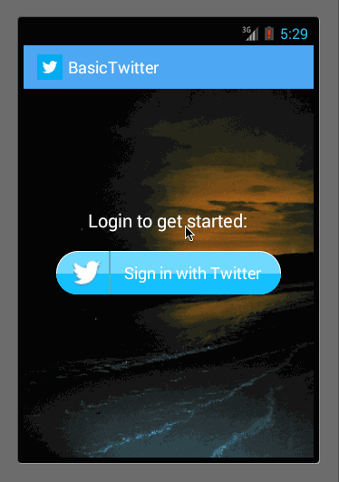

TwitterAppClient
================

Simple Twitter Client that leverages fragments to display the home and mentions timeline.

## Installation

Import this twitter source code into eclipse using **File => Import => Existing Android Code** and the project should now compile.

### First assignment:

It took me about six hours, and I presented what I did in front of the class at the start of the second week.

- Style the login screen for twitter

Put the background image, and built a login button using only drawables. The button does not completely look like the one in the mock, but I later discovered the mock button is actually an image. Still, it was fun trying to make it as a drawable.

- Pick a good Twitter launcher icon

Done

- Properly theme the ActionBar with correct text and background colors

Done

- Theme the tabs to fit a "twitter" color scheme

Done

- On compose screen, the "post" button should be customized (images or drawables) with a pressed state

I never got to put the compose button

- Add inline "favorite" and "reply" icons to each tweet. Favorite icon should toggle when pressed.

Done

- Style the timeline list to add custom borders between tweets and customize the pressed state of the ListView

Not done

- Build a "detail" view for Twitter that display full Tweet details

Not done

### Second assignment:

It took me about five hours

- Each activity launched should use a custom activity transition on the forward and back animations

Done. I had to add Compose activity to animate it

- Switching between home timeline and mentions timeline should use custom fragment transition animations on forward and back.

Not done

- When pressing "compose", window should slide down from the top and then after posting should dismiss by sliding up out of view.

Done

- Swiping one your own tweets to the right should bring up a confirm dialog asking if you'd like to delete it.

Done

- On deletion of a tweet after confirming, tweet should slide up until disappearing when being removed from the ListView.

Not done

- Swiping another person's tweets should prompt the user with a dialog to perform a retweet.

Done

GIF created with [LiceCap](http://www.cockos.com/licecap/).
